# Void Sun: plano de produção em 3D pixel art

Data: 07/10/2026. Estado: **proposta fundamentada, aguardando decisão do usuário; nenhuma implementação iniciada nesta pesquisa**.

## Recomendação

Fazer uma prova pequena com **personagem, equipamento e cenário realmente 3D, renderizados em pixel art durante o jogo**. Usar Blender para autoria e padronização, ComfyUI/Pixal3D como auxílio de geração e Godot estável para o laboratório visual. Avaliar a migração do jogo somente depois de aprovar arte, movimento e custo de integração.

O benefício central é compartilhar geometria, esqueleto, iluminação e perspectiva. Girar a câmera deixa de exigir oito ou dezesseis desenhos independentes. A armadura acompanha a mesma pose do corpo. Isso elimina a origem dos erros de perspectiva da amostra 3.12, mas não elimina automaticamente interseções, pesos ruins ou anatomia inadequada.

Pixelização deve ser a etapa de apresentação de uma boa arte 3D estilizada. Aplicá-la aos bonecos procedurais rejeitados não resolveria o problema. Não reutilizar aqueles humanos como base artística, nem expandir os atlas da 3.12 como se estivessem aprovados.

O alvo permanece: adultos compactos inspirados na linguagem de Sword of Convallaria, formas legíveis, rosto sem aparência infantil, paleta coerente, materiais expressivos e cenário detalhado. O personagem mais alto do vídeo de trys fica como referência de movimento e possibilidade futura, sem mudar agora a proporção escolhida.

**É possível automatizar a operação das ferramentas e manter o usuário apenas na direção e aprovação visual. Não há evidência de um fluxo gratuito que produza, sem revisão, qualquer personagem, roupa e animação nesse padrão.** O agente terá de inspecionar, corrigir e repetir etapas delimitadas. O projeto deve demonstrar que isso é viável em uma personagem antes de multiplicar o trabalho.

## O que foi examinado e o que está confirmado

- Quadros distribuídos pelos 17 vídeos locais; sequências mais próximas para observar água, instabilidade dos pixels, vegetação e movimento dos dois vídeos do X. Atenção adicional ao início e a 11:20 do tutorial PixelageGames. É análise visual por quadros e sequências, não reprodução contínua integral nem transcrição de toda a fala.
- As 11 páginas da conversa com Gemini, com extração de texto e inspeção das páginas renderizadas.
- Conteúdo do arquivo `3DPixelArt_Tutorial.7z`, extraído em diretório temporário sem executar o projeto.
- Documentação, licenças e páginas dos autores; histórico e implementação atual do Void Sun.
- Máquina: RTX 4070 com aproximadamente 12 GB de VRAM, aproximadamente 32 GB de RAM; Blender 5.2.2 LTS e Godot 4.7.2 instalados. ComfyUI local em revisão de julho de 2026; os novos nós nativos ainda precisam ser verificados numa instalação isolada.

Não foram instaladas ferramentas, executados geradores, feitos testes de desempenho ou alterados jogo, cartas, dados salvos e aplicativo. A pesquisa criou documentação. Vídeos promocionais não equivalem a benchmarks na máquina do usuário.

O relatório [análise dos materiais e fontes](analise-materiais-3d-pixel-art-2026-10-07.md) registra cada vídeo, as ressalvas do PDF, fontes e licenças.

## Ferramentas e função de cada uma

| Ferramenta | Função proposta | Condição de uso |
| --- | --- | --- |
| Blender já instalado | Modelagem assistida por IA, preparação da malha, UV, esqueleto, roupas, animação e exportação GLB | Livre; automatizar com Python e arquivos de parâmetros; qualidade exige inspeção |
| Blender Pixel Kit, SouthernShotty | Testar câmera, contornos, materiais e pixelização durante a autoria | Gratuito, GPL, listado para Blender 5.1; testar compatibilidade com 5.2.2; não é o renderizador do Godot |
| ComfyUI local, revisão fixada | Executar geração por fila e workflow versionado | Software livre; separar ambiente experimental do existente |
| Pixal3D | Candidato inicial para malhas de objetos e personagem a partir de referência original | Código/pesos principais MIT; verificar dependências; não entrega rig e equipamento pronto |
| TRELLIS.2 | Comparação controlada quando Pixal3D falhar ou perder qualidade | Código/pesos MIT; referência oficial exige mais memória que a GPU local, portanto avaliar integração quantizada antes |
| Godot 4.7.2 estável | Laboratório visual: renderização, movimento, câmera, água e efeitos | Livre, MIT; 4.8 está em desenvolvimento nesta data |
| Quaternius Universal Animation Library, versão Standard gratuita | Fonte de movimentos para adaptar ao nosso esqueleto | CC0; usar o pacote gratuito, sem pressupor acesso a todas as animações das versões pagas |
| SDXL local, opcional | Conceitos originais de referência quando os existentes não bastarem | Download sem custo, licença OpenRAIL++; revisar condições do checkpoint; não garante vistas consistentes |
| UniRig, opcional | Testar estimativa de esqueleto/pesos em uma cópia da malha | MIT nas fontes consultadas; confirmar componentes efetivamente disponíveis e adaptar ao padrão do jogo |

O [Blender Pixel Kit](https://superhivemarket.com/products/blender-pixel-kit) é o addon identificado no vídeo enviado. Os efeitos de compositor não são transferidos automaticamente por GLB: reproduzir o resultado no renderizador do jogo faz parte do trabalho.

Os [workflows nativos do ComfyUI](https://docs.comfy.org/tutorials/3d/pixal3d) existem, mas podem depender de uma revisão recente. A documentação inclui checkpoints quantizados e uma opção de múltiplas vistas. Não usar o gerador pago de vistas sugerido no exemplo; fornecer referências próprias. Não presumir que o ComfyUI local antigo já tenha esses nós.

**UniMate não será a base das animações**: o [repositório oficial](https://github.com/Friedrich-M/UniMate) diferencia código MIT de checkpoints CC BY-NC 4.0. Os modelos prontos têm restrição comercial e o projeto ainda relata falhas. A atualização de 05/10 já permite processar rigs próprios, mas isso não muda a licença dos pesos nem cria um rig do zero. Treinar outro modelo do zero não é uma alternativa econômica para este piloto.

Preferir movimentos da [biblioteca gratuita CC0](https://quaternius.itch.io/universal-animation-library), retargeting e correções feitas pelo agente. Movimentos específicos que não existirem no pacote serão construídos ou adaptados no Blender. Usar as animações não obriga a usar a aparência dos personagens Quaternius.

Não incluir como dependências necessárias Meshy/Tripo pagos, Nano Banana, Midjourney, Pencil+ ou Flat Kit. As ferramentas de produção propostas não exigem assinatura. Os assistentes Codex/Claude que o usuário já utiliza continuam sujeitos aos respectivos limites; se a exigência for também eliminar assinaturas e tokens desses assistentes, a qualidade de uma alternativa local de agente terá de ser avaliada separadamente. Software gratuito não significa processamento, eletricidade e revisão sem custo.

## Pipeline reproduzível

```mermaid
flowchart LR
  A[Referência original e direção aprovada] --> B[Malha candidata: IA ou autoria Blender]
  B --> C[Blender: geometria, materiais e rig padrão]
  C --> D[Roupas e itens compatíveis com a família]
  D --> E[Movimentos adaptados e corrigidos]
  E --> F[GLB e metadados versionados]
  F --> G[Godot: iluminação e render pixel art]
  G --> H[Inspeção de arte, movimento e desempenho]
  H --> I[Recurso aprovado para expansão]
```

IA de geração roda na produção, fora do jogo. O aplicativo distribui malhas, texturas, animações e shaders; não precisa carregar Pixal3D ou ComfyUI em cada computador/celular.

Cada recurso terá referência, origem/licença, versão, parâmetros, arquivos fonte e status: `RAW`, `TECH_VALIDATED`, `ART_APPROVED`. Compilar e passar em testes não promovem automaticamente a arte para aprovada.

## Etapa 0: verificar viabilidade local sem repetir o congelamento

Preparar um ComfyUI de pesquisa separado, fixando versão e dependências. Reutilizar downloads compatíveis por cache, sem atualizar cegamente a instalação existente. Conferir espaço livre, requisitos, licenças dos componentes e funcionamento dos nós antes de gerar.

Comparação inicial limitada: uma caixa de madeira, um elmo e um corpo humano em pose de referência, sem arma ou acessórios fundidos. Usar referências originais, a mesma entrada para comparar geradores e no máximo duas sementes por candidato. Começar pelo Pixal3D; testar TRELLIS.2 apenas se trouxer uma dúvida concreta de qualidade que a comparação resolva.

Configuração de partida proposta: resolução de geração moderada, por exemplo 512 quando suportada, quantização disponibilizada pela integração e descarregamento para RAM quando necessário. Um processo de geração por vez. Não manter jogo/editor pesado usando a GPU ao mesmo tempo. O pico total, incluindo o desktop, precisa deixar margem; não confundir limite de alocação do PyTorch com limite de toda a placa.

Registrar tempo, VRAM, RAM, tamanho, material e defeitos dos resultados. Primeira tentativa com limite de trabalho de 30 minutos e interrupção controlada se não houver progresso; esse limite é uma regra de custo proposta, não estimativa de velocidade. Se houver pressão de memória ou erro de driver, interromper e reduzir carga; não insistir em reinícios sucessivos.

Saída: relatório comparativo e seleção de um fluxo, ou diagnóstico de inviabilidade. **Ainda não afirmar que os vídeos de 6 GB comprovam que este pipeline completo funcionará bem em 12 GB.** A [implementação de referência do TRELLIS.2](https://github.com/microsoft/TRELLIS.2) informa requisitos maiores; integrações quantizadas são outro cenário e exigem medição.

## Etapa 1: provar a arte de uma personagem

Criar somente uma personagem adulta humana normal, tomando Brunhild como identidade do teste. A referência precisa representar a linguagem compacta aprovada, com olhos menores, leitura facial adulta, cabelo realmente curto, ombros e mãos proporcionais e silhueta clara. Não retornar ao rosto realista sobre corpo cilíndrico nem aumentar músculos para disfarçar problemas de forma.

Preparar uma referência frontal, lateral e traseira coerente quando viável. Desenhos independentes com detalhes incompatíveis não constituem automaticamente um bom turnaround. Pose e câmera precisam corresponder ao contrato do workflow utilizado; revisar referência antes de pagar o custo da reconstrução.

Comparar renderização sem pixelização e pixelizada, quatro vistas fixas e giro contínuo. Julgar rosto, corpo e cabelo na escala real do jogo, além da inspeção ampliada. As referências comerciais servem para direção; não extrair seus personagens/texturas para distribuição.

Testar duas configurações de grade do mundo, por exemplo 640x360 e 960x540 para saída 1920x1080, com enquadramento equivalente. São candidatos, não uma resolução final imposta. Definir paleta, contraste, largura de contorno e densidade de detalhe a partir da comparação. A interface e as cartas permanecem renderizadas separadamente em resolução adequada para leitura.

Saída: pequena galeria e vídeo curto da personagem parada/orbitando, sem armadura. Se não agradar visualmente, corrigir essa mesma fonte antes de preparar outros personagens.

## Etapa 2: construir o contrato de corpo e equipamento

Criar um esqueleto padrão da família humanoide, com convenções fixas de unidades, eixos, pose de referência, nomes dos ossos, frente do personagem, pontos de fixação e limites de escala. A malha candidata precisa ser preparada para deformar, com geometria adequada nos ombros, cotovelos, quadris, joelhos e rosto. Redução automática de polígonos não equivale a retopologia adequada para animação.

A família terá regiões nomeadas e medidas de referência. Não gerar um esqueleto diferente e incompatível a cada novo herói. UniRig pode auxiliar um teste, mas o contrato de rig e suas correções permanecem necessários.

Primeiro conjunto: roupa de viagem, peitoral, elmo, botas, espada e escudo. Inspecionar cada peça individualmente e em conjunto.

| Peça | Encaixe previsto | Verificação decisiva |
| --- | --- | --- |
| Elmo | Fixação à cabeça, volume interno adequado e máscara de cabelo | Teste de frente/lado/costas; cabeça não atravessa nem afunda |
| Espada e escudo | Fixações às mãos, eixo de pega e pose da mão | Pega correta, braço íntegro, item orientado como a ação |
| Roupa e partes flexíveis | Mesma estrutura de ossos, pesos transferidos/revisados | Dobras e amplitude de movimento sem rasgos |
| Placas rígidas e ombreiras | Peças articuladas ou pesos adequados à sua função | Não atravessar braço ou esconder membro por uma camada errada |
| Botas | Compatibilidade com pernas/pés e volume corporal | Contato com o chão e ausência de interseções nas passadas |

Aplicar máscaras nas regiões do corpo/cabelo que ficam cobertas. Não apagar membros inteiros para esconder um encaixe errado. Separar cabelo posterior/franja quando necessário e definir como elmos substituem/ocultam essas partes.

Só depois de aprovar o corpo normal, produzir uma variante forte: maior volume de ombros, tórax e membros sem encurtar pernas e sem parecer um anão. Aumento de altura, se aprovado, entra nas proporções e adaptações do rig; não é apenas esticar o boneco equipado. Corpo e roupas devem compartilhar os parâmetros aprovados de forma, incluindo correções das peças.

**Encaixe extensível significa preparar uma peça uma vez para cada família corporal suportada, e depois equipá-la sem ajustes por herói. Não significa que qualquer malha arbitrária gerada por IA vestirá qualquer espécie perfeitamente.** Peças incompatíveis precisam de variante ou restrição explícita, nunca deformação improvisada silenciosa.

Orcs, demônios, esqueletos e bestiais serão famílias anatômicas, não humanos com outra cor. Reutilizar a hierarquia humanoide quando a anatomia permitir; criar extensões ou outro rig para cauda, asas, focinho, pernas e proporções diferentes. Depois do humano normal/forte, provar **um orc e o mesmo conjunto de itens adaptado** antes de expandir para todas as raças.

Equipamento que afeta regras e aparência cosmética são dados separados. O jogador pode mostrar equipamento real ou usar o visual escolhido, mantendo os mesmos atributos. Preservar IDs e escolhas salvas. A aparência padrão nos seletores será frontal; enfrentar o adversário em batalha usa a direção de combate, não a frente padrão do retrato.

## Etapa 3: provar movimentos, não apenas poses bonitas

Primeiros movimentos: parado, caminhar, correr, ataque de espada, conjuração e receber dano/morrer. Selecionar clipes gratuitos existentes quando adequados e adaptar ao rig. Se o pacote gratuito não contiver uma ação, criá-la ou derivá-la com revisão; não contabilizar a biblioteca paga como material disponível.

Correções obrigatórias: pés apoiados sem deslizar durante a fase de contato; alternância das pernas; transferência de peso; quadril e ombros coerentes; braços contrabalançando; início, parada e mudança de direção; preparação, impacto e recuperação do golpe. Adaptar passo e velocidade ao deslocamento real. Escolher um controlador consistente de root motion ou movimento conduzido pelo jogo para cada ação, sem aplicar ambos simultaneamente.

Usar retargeting, ajustes de curvas, IK de pés e mãos quando necessário e transições de estado. Cabelo e capa precisam de movimento secundário limitado; não simular tecido pesado em todo personagem no celular. Não usar seno aplicado a membros como substituto das animações de locomoção.

Evento de impacto liga animação e efeito visual; as regras de dano continuam sob autoridade do sistema de jogo. Conjuração inclui preparação, sustentação, liberação e retorno. Arco e arma de duas mãos exigirão referências e poses de pega próprias em uma etapa posterior.

Validar equipado e cosmético, corpo normal e forte, nos ângulos fixos e numa volta completa da câmera. Uma animação bonita sem roupa não comprova que o conjunto está pronto.

## Etapa 4: renderização pixel art e câmera

Implementar câmera ortográfica como ponto de partida, preservando volume e ângulos intermediários. Giro por arraste, zoom contínuo, presets dos ângulos fixos, limites de inclinação e enquadramento. Os presets devem usar a mesma câmera e o mesmo mundo. O corte artístico de certas superfícies e a leitura dos personagens precisam funcionar além da câmera de apresentação.

Pipeline visual proposto: renderização com amostragem suficiente para reduzir instabilidade; materiais estilizados com rampas de luz; contornos seletivos de profundidade/normais; redução controlada para a grade artística; ampliação nítida e composição da UI separada. Comparar isso com render direto em baixa resolução. Desabilitar todo antialiasing indiscriminadamente pode piorar a estabilidade; o resultado final nítido depende da ordem dos passes.

Quantização para estabilidade deve atuar na representação/renderização, preservando movimento e física contínuos. Snap e compensação de deslocamentos de tela podem ajudar a translação; rotação e zoom contínuos mudam cobertura dos pixels e não admitem estabilidade perfeita por uma única regra de arredondamento. Medir tremulação em bordas, cabelo, armas finas e grama durante os movimentos reais. Não vender um shader como solução universal de jitter.

Evitar contorno preto grosso em todas as faces, ruído de textura, brilho realista incompatível com a paleta e dithering excessivo. Coerência entre céu/ambiente, luz direta, sombras, personagem e efeitos faz parte da direção de arte.

O shader da demonstração PixelageGames usa normal/roughness da tela. Segundo a [documentação do Godot](https://docs.godotengine.org/en/stable/tutorials/shaders/screen-reading_shaders.html), esse buffer depende de Forward+ e não está disponível nos renderizadores Mobile/Compatibility. Planejar desde o piloto uma alternativa de contornos/material que funcione no modo móvel; não depender de copiar o shader sem adaptações.

## Etapa 5: um microcenário representativo

Proposta de cenário original: **Margem do Farol Apagado**, um pequeno santuário de pedra junto ao rio, ligado ao eclipse e à temática Void Sun. Área delimitada, com um trecho de ruína, caminho irregular, árvore, vegetação baixa, água rasa/profunda e caixa quebrável. Não construir uma vila ou mapa inteiro para testar o renderizador.

O piso e as construções terão irregularidades, variação de materiais, juntas e detalhes de escala coerente. Geometria 3D não exige voxel aparente ou blocos Minecraft. Objetos devem estar apoiados, com sombra de contato e fundações, sem aspecto flutuante. Não preencher o terreno só com quadrados repetidos.

Água: combinar profundidade, transparência/cor, ondas, reflexos simplificados, espuma de margem/obstáculo e ondulações de contato. A animação deve ter direção e escala física visualmente coerentes, sem mover uma foto inteira. Não é necessário resolver fluidodinâmica pesada para alcançar água estilizada convincente; medir reflexos e refração antes de escolher o custo final.

Vegetação: copas modeladas em agrupamentos e materiais de luz coerentes, evitando volumes facetados grosseiros. Movimento por galhos/folhas ou deformação dos vértices, com máscara que mantém raiz/tronco principal estáveis, diferenças de fase e direção de vento compartilhada. Grama reage ao vento sem transformar toda árvore num cartaz girando. Transparência e densidade da copa serão avaliadas para reduzir cintilação e custo.

Iluminação: paleta de luz/sombra definida, sombras de contato, pontos emissivos do farol/ruína e partículas discretas. Volumetria é acabamento opcional; escolher custo por preset e nunca usá-la para esconder arte ruim.

Caixa: golpe com impacto, ruptura, pedaços de madeira visíveis, trajetórias e colisões limitadas, poeira e duração controlada dos destroços. Depois, três efeitos distintos: projétil de fogo com explosão; magia de gelo com cristais; escudo mágico com formação e dissipação. Cada efeito terá perfil de cor, forma, duração, trajetória, som e evento de contato. Não trocar apenas a cor de uma mesma partícula para todas as magias.

Saída: amostra navegável e vídeos de câmera fixa/contínua, movimento e efeitos. Meta inicial a medir: 60 fps no PC da amostra e preset de 30 fps em celular representativo; números são critérios propostos, ainda não resultados. Reduzir custo por materiais, sombras, reflexos, partículas e distância antes de degradar a identidade visual. Somente testar mobile depois de escolher aparelho-alvo.

## Etapa 6: decisão de engine e integração do jogo

O Godot favorece editor de cenas, rigs, animação, física, efeitos e exportação mobile. A [versão estável consultada](https://godotengine.org/download/linux/) é 4.7.2, já instalada; [4.8-dev7 é preview](https://godotengine.org/download/preview/). Não migrar em função do título de um vídeo.

O Void Sun atual usa Svelte/TypeScript/Electron e Three.js na amostra. Esses componentes não se tornam um projeto Godot ao importar GLB. Migrar UI, persistência e regras tem custo real. Os mesmos assets GLB e princípios de shader podem ser usados no Three.js; a engine não cria a qualidade artística sozinha.

Após a prova, decidir entre:

1. **Manter o jogo atual e integrar os recursos preparados**, se entregar a qualidade/performance desejada com menor custo.
2. **Migrar por módulos para Godot**, se editor, pipeline de animação e mobile justificarem reescrita e manutenção. É a direção mais promissora para avaliar, não uma decisão já aprovada.

Não manter duas implementações completas de produção por padrão. O laboratório é temporário e os assets portáveis reduzem o custo de trocar o renderizador. Antes da decisão, levantar tempo gasto por módulo, incompatibilidades e esforço de portar o menor ciclo jogável.

Se houver migração, exportar modelos de dados e exemplos determinísticos do motor de cartas: personagens, decks, cartas, equipamento, estados/ações, RNG e resultados. Conferir equivalência com o sistema atual antes de substituir uma regra. Preservar banco/perfil, IDs e artes full art aprovadas da coleção Protótipo; não reabrir o catálogo para regeneração.

Primeiro ciclo integrado: uma batalha de cartas no cenário aprovado, com 6 posições por equipe, frente e retaguarda coerentes no mesmo sistema de coordenadas. Jogador e inimigo enfrentam um ao outro independentemente da câmera. O mapa não gira os slots isoladamente para simular perspectiva. HUD, grimório, cemitério, equipamentos, iniciativa e mão inicial usam as regras reais.

A amostra precisa ser acessível pelo mesmo atalho do menu de aplicativos usado pelo usuário, com indicação clara de laboratório, sem trocar o jogo salvo por uma versão de desenvolvimento. Uma entrega aberta somente no browser do agente não conta como acesso concluído.

## Próximas etapas, somente após a prova

- Expandir humano normal/forte e provar orc com equipamento; depois outras anatomias e cosméticos.
- Ampliar biblioteca de ações e perfis de magia; variação real por arma e habilidade.
- Campanha no mesmo mundo 3D, com câmera aproximando para batalha no local, entrada progressiva da UI e retorno à exploração. Usar seleção de área adequada para colisões, campo e câmera, sem presumir que toda encosta estreita comportará uma arena.
- Reaproveitar o sistema de materiais/efeitos para lava e pântano; acrescentar novos biomas após aprovar rio/ruína.
- Mundo maior com carregamento por setores, níveis de detalhe e orçamento de memória; não prometer mundo aberto completo a partir de um diorama.
- Preparar fronteiras de estado/ações para futuro co-op de quatro jogadores; autoridade, reconexão, turnos e papéis de combate continuam uma etapa de gameplay/rede, não um efeito do renderizador.
- Preservar diálogos em balões pretos levemente transparentes, texto branco e escolhas no balão. Aura amarela no objeto/NPC interativo, jamais no balão.

## Ordem de entrega e critérios de passagem

| Entrega | Conteúdo limitado | Só avançar quando |
| --- | --- | --- |
| A | Benchmark pequeno e referência da personagem | Fluxo executa dentro da máquina e referência tem direção coerente |
| B | Uma personagem parada em todos os ângulos | Aparência aprovada na escala do jogo; pixels legíveis |
| C | Itens + caminhada e ações, depois variante forte | Corpo/roupa íntegros, pega correta, pés sem deslizar, aparência aprovada |
| D | Margem do Farol, câmera e água/vento | Cena bonita também em movimento, sem flutuação e sem jitter grosseiro |
| E | Ruptura da caixa e três magias | Efeitos distintos, reação convincente, orçamento medido |
| F | Menor ciclo de batalha e decisão de engine | Regras preservadas, acesso real pelo atalho, custo de migração explícito |

Cada passagem exige verificações técnicas **e avaliação artística do usuário**. Se a arte falhar, corrigir a etapa atual; não aumentar o número de recursos para parecer progresso. Limitar cada rodada de referência a poucos candidatos e comparar alterações da mesma fonte. Registrar os motivos de rejeição evita redescobrir os mesmos erros com outra IA.

Não fixar cronograma/tokens de todo o projeto antes de medir B e C. Essas etapas revelarão o custo real por corpo, roupa e movimento. Se o custo artístico for inviável, a alternativa é **autoria 3D com rig comum para renderizar sprites**, usando as mesmas roupas e poses na exportação; testar transição de vistas sem afirmar que esse fallback atende igualmente ao giro contínuo.

## Entregáveis e continuidade entre agentes

Cada amostra aprovada deverá preservar `.blend`, GLB, texturas/materiais, rig padrão, parâmetros de anatomia/encaixe, nomes/eventos dos clipes, workflow ComfyUI, seeds, versões/hashes, licenças e capturas/vídeos de validação. Scripts de geração, preparação, retargeting e QA terão execução reproduzível. Regenerar apenas a parte alterada; não refazer catálogos ou baixar modelos a cada sessão.

Para Codex/Claude: ler este plano, `CONTINUIDADE.md`, `revisao-visual-3.12.md` e a análise anexa antes de implementar. Distinguir proposta, implementação técnica e arte aprovada. Não chamar o primeiro boneco gerado de motor final, nem anunciar fidelidade a Sword of Convallaria com base em um build que compilou.

**Próxima ação concreta sugerida:** etapa A, seguida da prova B; não instalar todos os experimentos nem produzir todas as raças, armaduras, animações e mapas de uma vez.
