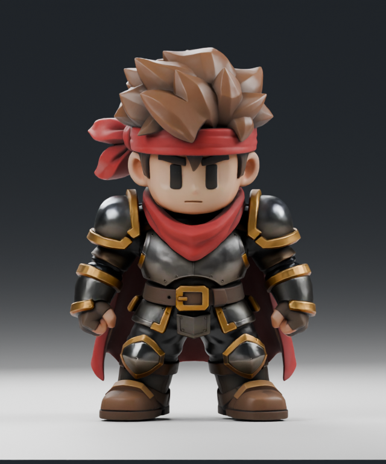
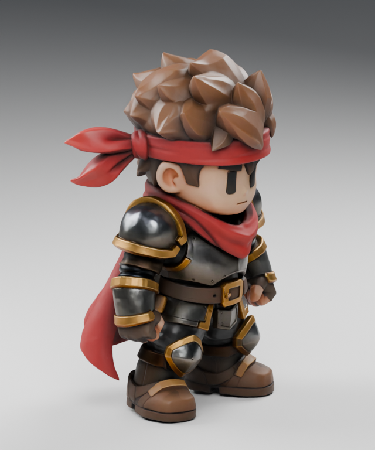
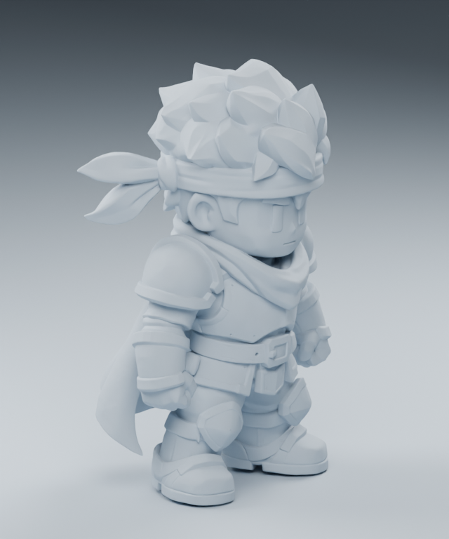
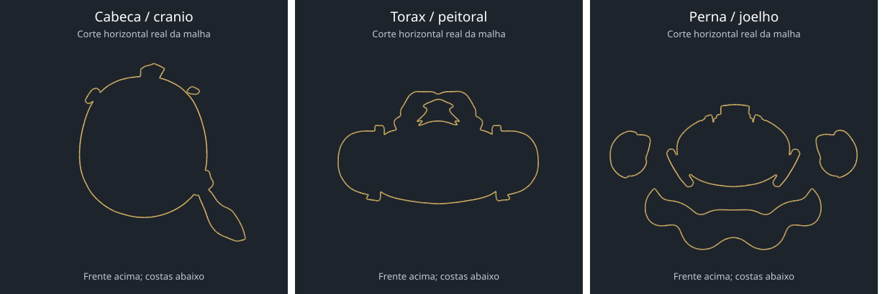

# Avaliação do guerreiro chibi como referência para corpo modular

Data: 08/10/2026. Pedido: avaliar os dois arquivos baixados por Dyego e verificar se permitem obter um corpo sem cabelo, armadura ou outros itens, preservando as proporções apreciadas.

## Veredito

**VIÁVEL COMO REFERÊNCIA PARA RECONSTRUÇÃO; NÃO APROVADO COMO CORPO-BASE PRONTO.**

O volume e as proporções podem orientar uma base nova. O arquivo não contém um corpo anatômico completo e independente escondido sob as roupas. Remover cabelo e equipamento da superfície atual não revela automaticamente uma base íntegra. A anatomia coberta precisa ser reconstruída e a malha destinada à animação precisa ser refeita de maneira controlada.

Nenhum corpo novo foi produzido ou aprovado nesta avaliação. Não houve integração no jogo, geração de imagens ou geração Pixal3D. Os arquivos baixados permaneceram intactos.

## Arquivos e diferença real

| Arquivo | Tamanho | Objetos de malha | Triângulos | Rig / animações |
| --- | ---: | ---: | ---: | --- |
| GLB original dentro do ZIP, `source/pool2640.glb` | 34.026.084 bytes | 1 | 961.086 | Ausentes |
| GLB convertido baixado separadamente | 55.133.612 bytes | 9 | 961.086 | Ausentes |

Comparação geométrica: os pontos únicos e os triângulos da superfície coincidem após ordenar e comparar posições com precisão de até seis casas decimais. Os dois arquivos representam a mesma superfície, não dois níveis de qualidade. Ambos têm 480.382 posições geométricas únicas.

O original guarda 500.698 vértices incluindo duplicatas necessárias às UVs. O convertido guarda 527.484, acrescenta tangentes, quatro conjuntos de UVs e distribui a geometria em blocos de até 65.532 vértices. Essas divisões percorrem partes variadas do personagem; não correspondem a cabelo, corpo, armadura ou capa separados. Elas e os atributos extras explicam o aumento do arquivo, sem aumento do detalhe geométrico.

O nó do original usa escala 0,5; o convertido não repete essa escala. A superfície em coordenadas locais é igual, mas a altura importada difere. No Blender, a cópia original tinha altura 1 unidade. Somente a cópia de inspeção foi normalizada para altura 2, para facilitar a leitura dos renders.

## O que foi verificado

- Importação real do original no Blender 5.2.2 LTS; material e texturas embutidas carregados.
- Vistas frontal, posterior, perfis e três quartos, além de material neutro para verificar a forma sem a textura.
- Uma única componente geométrica conectada depois de unir apenas posições coincidentes das costuras de UV. Cabelo, faixa, rosto, armadura, capa, luvas e botas estão integrados na superfície.
- Cortes horizontais reais da geometria. Não há uma camada anatômica completa e independente dentro dessa casca. Pequenos contornos internos de detalhes não equivalem a um corpo completo.
- Mãos em punho, com formas de luva e dedos simplificados. Elas não fornecem mãos abertas com cinco dedos independentes e topologia própria para animar.
- Malha densa, triangular e sem esqueleto, pesos, ações ou modificadores de deformação.
- Após unir posições exatamente iguais: 465 arestas com mais de duas faces incidentes; nenhuma borda aberta. Isso exige revisão topológica antes de rig, não é prova de que esteja adequado à animação.

Não foi feito teste de movimento, pois o arquivo não possui rig nem animações. O acabamento pixel art do jogo também não foi avaliado: os renders são estudos neutros da fonte.

## Renders da inspeção

Os cortes mostram apenas as interseções da superfície fornecida. Não são propostas de forma para um novo corpo. As posições dos cortes estão registradas em `reports/crosssections.json`.

## Caminho recomendado para a amostra seguinte

1. Preservar este guerreiro como referência intocada. Usar suas proporções externas como guia; distinguir volume da armadura de volume do corpo. Não projetar a base inteira por cima do equipamento, pois isso incorporaria ombreiras e botas à anatomia.
2. Criar uma base sem roupas, com crânio completo, pescoço, ombros, axilas, tronco, quadris, pernas, pés e mãos completas. Preservar a proporção compacta apreciada por Dyego e ajustar o rosto à direção adulta do Void Sun. Validar a base sem qualquer peça antes de avançar.
3. Retopologia controlada com fluxo próprio para ombros, cotovelos, quadris, joelhos e dedos. Usar a fonte como referência de forma, não considerar redução automática de polígonos uma solução de rig.
4. Definir pose neutra A/T e esqueleto compartilhado. Testar ombros, axilas, cotovelos, quadris e mãos com amplitude representativa.
5. Construir uma única roupa/armadura sobre essa base, em objetos separados, com espessura, folga e pesos adequados. Peças rígidas precisam seguir os ossos corretos; peças flexíveis precisam deformar com a base. Usar máscaras do corpo por região quando houver cobertura, preservando a anatomia íntegra da fonte base.
6. Testar primeiro uma amostra com a base, um conjunto de equipamento, cabelo removível, caminhada/corrida e uma ação de habilidade. Revisar todos os ângulos e somente então ampliar o catálogo.

O ajuste futuro deve seguir contratos de corpo/rig, regiões e pontos de encaixe definidos. Esses contratos tornam a produção reproduzível, mas não garantem que qualquer modelo externo se encaixe automaticamente. Corpos de diferentes raças ou constituições precisam de compatibilidade explícita e validação de deformação.

No jogo, equipamento e visual devem continuar independentes: mostrar o equipamento funcional ou uma substituição cosmética não deve alterar os atributos da build. Essa avaliação não altera essa lógica.

## Skills e execução

Skills locais acessíveis e lidas: `voidsun-direcao-arte`, `character-artist`, `retopology`, `qa-review` e `chibi-style`. As orientações foram usadas para a avaliação. Não há ferramenta Blender MCP exposta nesta sessão; o Blender foi executado diretamente em cópias, com scripts de inspeção. Os renders usaram CPU e dois threads, sem disparar inferência local pesada.

## Fonte, licença e crédito

Autor: Elif Romero. Obra: **Chibi Armored Warrior - Tripo 3D vs SupaVoxel**.

Fonte: https://skfb.ly/pO9Xr

URL completo preservado nos metadados do convertido: https://sketchfab.com/3d-models/chibi-armored-warrior-tripo-3d-vs-supavoxel-29198cd4cc294249b9dee8aa8299f828

Licença informada pelo usuário e embutida no GLB convertido: **Creative Commons Attribution 4.0 International**, https://creativecommons.org/licenses/by/4.0/ . A página oficial da licença foi consultada; a página do modelo não pôde ser aberta pelo navegador de pesquisa nesta sessão.

A licença permite adaptação e uso comercial com atribuição, link à licença e indicação das alterações. Se houver uma versão derivada, preservar o crédito do autor e registrar a reconstrução/modificações feitas pelo projeto. Os renders desta avaliação exibem a fonte com iluminação nova e escala normalizada; não são um corpo original criado pelo Void Sun.

## Organização dos arquivos

- `source/original-pool2640.glb`: cópia do original extraída do ZIP.
- `source/inspection.blend`: cena de inspeção, **não um corpo-base**.
- `reports/glb-structure.json`: estrutura e hashes dos dois arquivos.
- `reports/geometry-analysis.json`: comparação de superfície, componentes e topologia.
- `reports/blender-import.json`: dados da importação real.
- `reports/crosssections.svg` / `.json`: cortes geométricos.
- `renders/`: renders brutos.
- `docs/amostras/warrior-inspecao-20261008/`: imagens de avaliação para consulta.
- Scripts ao lado deste relatório reproduzem apenas a análise. Eles usam caminhos locais e não são ferramentas de modelagem de um novo corpo.
